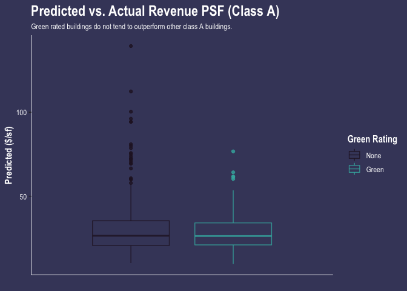
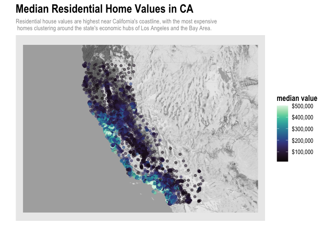
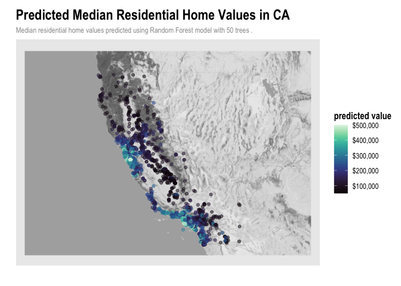
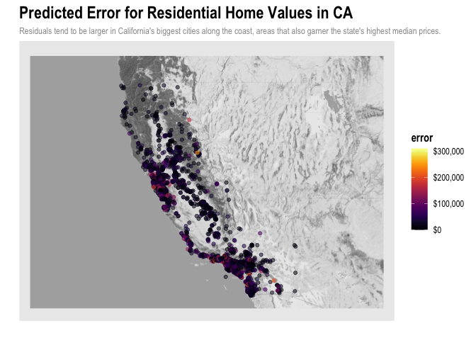
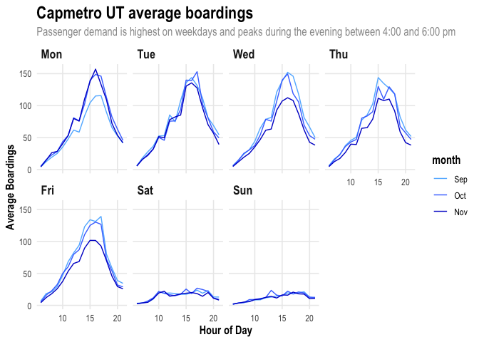
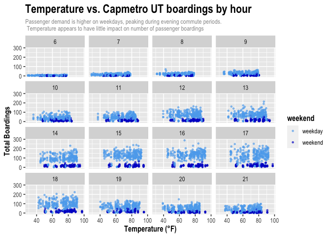

Portfolio: ggplot and gganimate
================
Alice Kemp

## **Predictive model building: green certification**

### Introduction

Pricing rental terms for office buildings in the commercial real estate
sector is a complex, multifaceted problem that incorporates a variety of
attributes including asset class, age, renovation status, number of
floors, location, and the availability of amenities. Within an asset
class and submarket, asking rates for office space tend to vary greatly
based on these differing characteristics. In this study, we investigate
how a building’s “green” rating impacts its revenue, calculated as the
building’s rent per square foot multiplied by its occupancy rate. As
efforts to increase sustainability by adding environmentally features
that certify a building to be LEED or Energystar certified, the
financial impacts and returns to investment become increasingly relevant
to a building’s landlord.

### Data

The data used in this study covers 7,894 properties extracted from a
leading commercial real estate database. The property attributes
included are geographic cluster, size, year-over-year local employment
growth, rent per square foot, leasing rate, stories, age, renovation
status, asset class, green rating, amenities, annual demand for cooling,
annual demand for heating, annual precipitation, utility costs, and
local market average rent. Of the 7,894 properties included in the
original data, 685 buildings are LEED or Energystar certified,
representing approximately 8.7%.

### Methodology

First, the data was cleaned to remove missing values and filtered to
include only buildings with full service gross rents to better compare
across properties. After filtering, the data set narrowed minimally to
7,546 total properties, including 640 green rated properties. Diving
deeper into the data, we find that the proportion of green rated
buildings is larger in Class A properties with 17.2% of buildings being
LEED or Energystar certified compared to only 2.8% of Class B
properties. This trend was utilized in the model analysis to investigate
whether or not green rated buildings had higher revenues than others,
both over all asset classes and specifically within Class A properties.
After creating the model, figures of actual versus predicted price were
created to visualize the distribution of revenues across green ratings.
Furthermore, a variable importance plot and a partial dependence plot
was created to investigate the relative predictive power of individual
attributes in the model and the marginal effects of these attributes on
revenue.

<table>
<caption>
Table 1.1: Proportion of Green Rated Buildings by Asset Class
</caption>
<thead>
<tr>
<th style="text-align:left;">
Class_A
</th>
<th style="text-align:left;">
Class_B
</th>
<th style="text-align:left;">
Green_Certified
</th>
<th style="text-align:left;">
Proportion
</th>
</tr>
</thead>
<tbody>
<tr>
<td style="text-align:left;">
0
</td>
<td style="text-align:left;">
0
</td>
<td style="text-align:left;">
0
</td>
<td style="text-align:left;">
23.5%
</td>
</tr>
<tr>
<td style="text-align:left;">
1
</td>
<td style="text-align:left;">
0
</td>
<td style="text-align:left;">
0
</td>
<td style="text-align:left;">
82.8%
</td>
</tr>
<tr>
<td style="text-align:left;">
0
</td>
<td style="text-align:left;">
1
</td>
<td style="text-align:left;">
0
</td>
<td style="text-align:left;">
73.5%
</td>
</tr>
<tr>
<td style="text-align:left;">
0
</td>
<td style="text-align:left;">
0
</td>
<td style="text-align:left;">
1
</td>
<td style="text-align:left;">
0.2%
</td>
</tr>
<tr>
<td style="text-align:left;">
1
</td>
<td style="text-align:left;">
0
</td>
<td style="text-align:left;">
1
</td>
<td style="text-align:left;">
17.2%
</td>
</tr>
<tr>
<td style="text-align:left;">
0
</td>
<td style="text-align:left;">
1
</td>
<td style="text-align:left;">
1
</td>
<td style="text-align:left;">
2.8%
</td>
</tr>
</tbody>
</table>
<table>
<caption>
Random Forest RMSE
</caption>
<thead>
<tr>
<th style="text-align:right;">
x
</th>
</tr>
</thead>
<tbody>
<tr>
<td style="text-align:right;">
6.7683
</td>
</tr>
</tbody>
</table>

<!-- --><!-- --><!-- -->

### Conclusion

To build the best predictive model of revenue based on the given
features, a random forest model was created using an 80% train-test
split for cross validation purposes. Within the random forest model,
5-fold cross validation was used to prevent overfitting of the training
data. The model was then stress tested using the remaining test data
set, resulting in an RMSE of approximately $6.81/sf. Next, the data was
plotted with actual revenue of the test data against predicted revenue
to showcase model accuracy and any trends regarding green rating’s
impact on revenue. If LEED/Energystar rated buildings did garner higher
rents, we would see an outsize population of green buildings on the
graph where actual and/or predicted rents are higher. However, we do not
observe such a trend in the overall data. Next, we dug deeper into the
Class A data specifically, which tend to have a higher proportion of
green rated buildings than Class B or C properties. However, we again do
not observe an abnormally large amount of green rated buildings in the
upper ranges of predicted or actual revenue, indicating that green
rating has a minimal, if any, effect on a building’s revenue.  
To further catalyze on this question, a partial dependence plot was
created to determine the marginal effect that a building being green
rated has on revenue. From the figure, we see there is a slight increase
in revenue for green buildings of approximately 0.34/sf. Looking at the
variable importance plot, we see that market rent, size, stories, and
age have the highest predictive power based on our model. Overall, we
find no significant evidence that green rated buildings garner higher
revenues than other buildings.

## **Data visualization: Flights at ABIA**

Analyzing flight data from the ABIA airport in Austin, Texas, we
investigate trends in airline consistency measured by the average net
delay (arrival delay minus departure delay) by day of week. As observed
in the figure below, the most consistent airlines were ExpressJet (XE),
Southwest Airlines (WN), and American Airlines (AA). These airlines were
the most unchanged across days and tended to have shorter tails in the
positive net delay direction. On the other hand, the least consistent
airlines included Atlantic Southeast Airlines (EV) and Northwest
Airlines (NW), and Jetstream International (OH) which tended to have
higher variation in net delays and larger right tails.

<!-- -->

## **Predictive model building: California housing**

### Introduction

The aim of this analysis is to predict median house value of California
residential homes by census tract based on a selection of
characteristics in each census tract including median age, population,
number of households, number of rooms and bedrooms, and median income.  
\* longitude, latitude: coordinates of the geographic centroid of the
census tract  
\* housingMedianAge: median age in years of all residential households
in the census tract  
\* population: total population of the tract  
\* households: total number of households in the tract  
\* totalRooms, totalBedrooms: total number of rooms and bedrooms for
households in the tract  
\* medianIncome: median household income in USD for all households in
the tract  
\* medianHouseValue: median market value of all households in the tract

### Data

The data set used in this analysis includes information on 20,640 census
tracts in the state of California. The data was filtered to remove
missing values and the totalBedrooms and totalRooms variables were
normalized by dividing by the number of households in each tract.

### Methodology

First, the centroids of each cluster were mapped and colored according
to their median house value. Then, a random forest model was created to
predict median house value based on all above attributes. An 80%
train-test split was utilized to prevent overfitting of data. When
stress tested on the test set data, the random forest model generated an
out-of-sample fit of approximately $49,651.00. The predicted test set
values were then mapped with a color scale representing median house
value. Next, the residuals for each census tract were mapped with a
color scale representing the error generated from the random forest
model. Finally, a variable importance plot was created to show the
variables with the most predictive power in projecting median house
value.  
<!-- --><!-- --><!-- -->

### Conclusion

From the first figure, we observe that there are two obvious clusters of
high median home values located near the economic hubs of Los Angeles
and San Francisco. Near these clusters, we also observe the largest
errors from our random forest model, indicating that our model performs
worse in predicting home values in the upper quantiles of median home
values. In the final figure, we visualize the predictive power of the
Random Forest model’s features using a variable importance plot. From
this plot, we conclude that a census tract’s median income, geographic
location, and median age are the most important features in predicting
median house value, with population, number of households, and
rooms/bedrooms per household ranking among the lowest in terms of
predictive power. These results tend to support the underlying data
trends with higher income census tracts being associated with higher
median home prices in the Los Angeles and San Francisco areas.

## **KNN Model**

The 350 trim level yields a higher optimal value of k, equal to 32. This
may be due to the fact that there is less variance in the data for 350
trim models than for 65 AMG models. Thus, the 350 KNN model can optimize
with a higher value of k (more neighbors, but lower sd) to minimize
error as compared to the KNN model for the 65 AMG cars.  
<!-- --><!-- --><!-- -->

\##**CapMetro Passenger Analysis in Austin, Texas**
<!-- --><!-- -->
