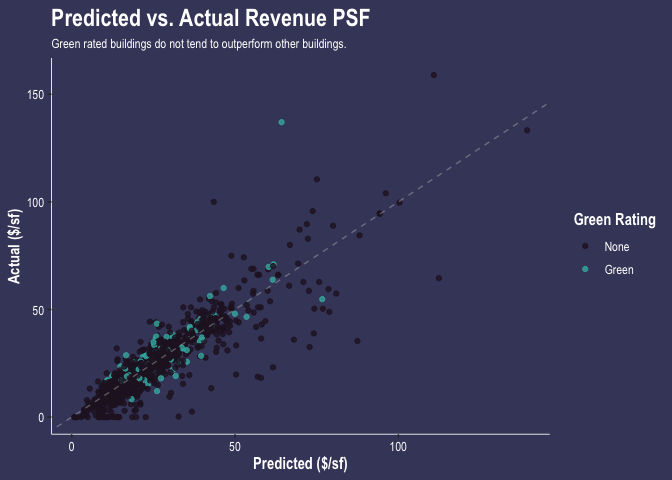

Portfolio: ggplot and gganimate
================
Alice Kemp

## **1) Data visualization: Flights at ABIA**

Analyzing flight data from the ABIA airport in Austin, Texas, we
investigate trends in airline consistency measured by the average net
delay (arrival delay minus departure delay) by day of week. As observed
in the figure below, the most consistent airlines were ExpressJet (XE),
Southwest Airlines (WN), and American Airlines (AA). These airlines were
the most unchanged across days and tended to have shorter tails in the
positive net delay direction. On the other hand, the least consistent
airlines included Atlantic Southeast Airlines (EV) and Northwest
Airlines (NW), and Jetstream International (OH) which tended to have
higher variation in net delays and larger right tails.

<!-- -->

## The Billboard Hot 100

The musical diversity of the Billboard 100 has increased over the few
last decades, last peaking in 1966 when 832 unique songs appeared on the
list. Diversity then dropped into the early 2000’s before rising again
to reach 804 distinct appearances on the Billboard 100 in 2020.  
<!-- -->

There have been 19 artists who have had at least 30 songs appear on the
Billboard Top 100 more than ten times since 1958. As of 2021, leading
the lineup is Elton John with 52 songs followed by Madonna with 44 and
Kenny Chesney with 42.
<!-- -->

## **KNN Model**

The 350 trim level yields a higher optimal value of k, equal to 32. This
may be due to the fact that there is less variance in the data for 350
trim models than for 65 AMG models. Thus, the 350 KNN model can optimize
with a higher value of k (more neighbors, but lower sd) to minimize
error as compared to the KNN model for the 65 AMG cars.  
<!-- --><!-- --><!-- -->

##**CapMetro Passenger Analysis in Austin, Texas**
<!-- --><!-- -->
